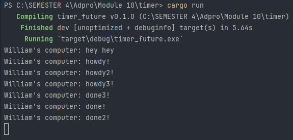
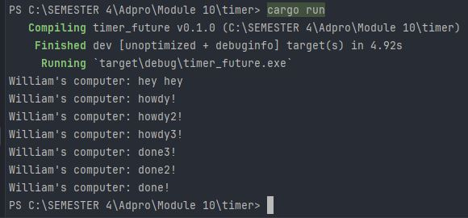

# Tutorial 10 - Advanced Programming - Timer
**William - 2206083432 - C**

### 1.2. Understanding how it works

Walaupun `println!("William's computer: hey hey")` dijalankan pada baris yang lebih bawah daripada perintah print lainnya,
`William's computer: hey hey` dicetak lebih dahulu daripada perintah print lainnya.
Hal ini terjadi karena operasi print lainnya berada di dalam `async {...}` yang menjadikan proses eksekusi kode di dalamnya menjadi asinkronus, tidak memperuhi eksekusi baris di bawahnya.
Maka dari itu, `William's computer: hey hey` dapat tercetak duluan karena tidak perlu menunggu program asinkronus selesai.

### 1.3. Multiple Spawn and removing drop
#### Removing statement: drop(spawner);

Dengan menghapus perintah `drop(spawner);` maka program akan menganggap spawner belum selesai dan masih berjalan terus untuk menerima tugas lainnya, dapat dilihat pada gambar bahwa program tidak selesai walaupun perintah print sudah selesai dicetak semua.
Maka dari itu, diperlukan penulisan secara eksplisit agar memastikan spawner selesai digunakan

#### Put the statement again: drop(spawner);

Urutan done teraksekusi tidak sesuai dengan urutan baris pada kode di main.rs, hal ini terjadi karena dengan membuat multiple spawners, maka program berjalan secara independen.
Artinya setiap spawner akan berjalan secara konkurensi sehingga hasil dari print dapat menjadi acak.
