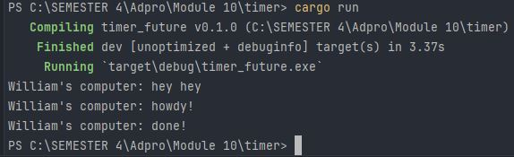

# Tutorial 9 - Advanced Programming - Timer
**William - 2206083432 - C**

### 1.2. Understanding how it works

Walaupun

`println!("William's computer: hey hey")` dijalankan pada baris yang lebih bawah daripada perintah print lainnya,
`William's computer: hey hey` dicetak lebih dahulu daripada perintah print lainnya.
Hal ini terjadi karena operasi print lainnya berada di dalam `async {...}` yang menjadikan proses eksekusi kode di dalamnya menjadi asinkronus, tidak memperuhi eksekusi baris di bawahnya.
Maka dari itu, `William's computer: hey hey` dapat tercetak duluan karena tidak perlu menunggu program asinkronus selesai.

